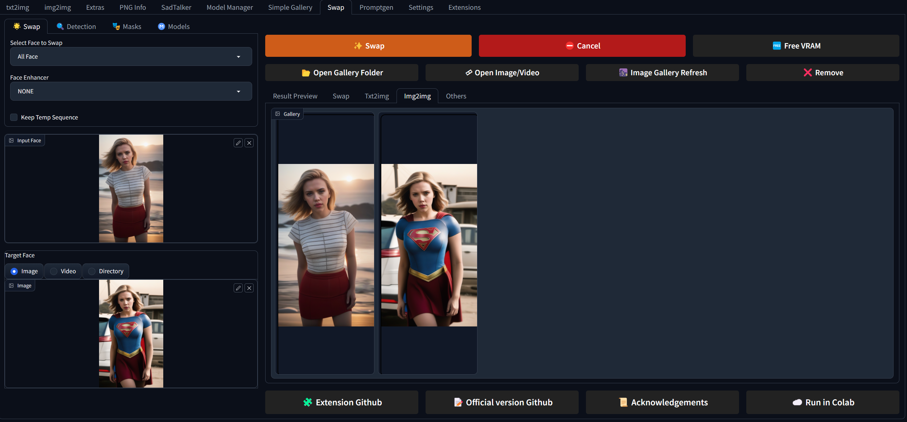

## Description

1st of all, Im not a programmer, ChatGPT helped a lot.

A simple face swapper adapted to Automatic1111 from [harisreedhar](https://github.com/harisreedhar/Swap-Mukham) work, and based on insightface inswapper.
### Important
- Output folder is stable-diffusion-webui\Outputs\swap-mukham, trying to make output folder change work.
- Incompatibility with Roop Extension, check Troubleshooting section.
  
## Changes
Changes 16/08/2023
- Updated Gallery, added Others Tab.
- Added more enhancers.
  
Changes 10/08/2023
- added gallery, now you can drag an drop images from gallery.

Changes 09/08/2023
- stylized UI Buttons and info panel.
  
[Full Changelog](https://github.com/rauldlnx10/sd-webui-swap-mukham/blob/main/change_log.txt)

  
### Screenshot

## Installation

- Go to Automatic1111 Extensions Tab - Install from URL, paste ``https://github.com/rauldlnx10/sd-webui-swap-mukham.git`` and hit Install.

## Troubleshooting 

### How to solve roop conflicts:
[Guide](https://github.com/rauldlnx10/sd-webui-swap-mukham/issues/6#issuecomment-1666626342)
  
## Disclaimer

We would like to emphasize that our deep fake software is intended for responsible and ethical use only. We must stress that **users are solely responsible for their actions when using our software**.

1. Ethical Guidelines:
Users are expected to adhere to a set of ethical guidelines when using our software. These guidelines include, but are not limited to:

Not creating or sharing deep fake content that could harm, defame, or harass individuals.
Obtaining proper consent and permissions from individuals featured in the content before using their likeness.
Avoiding the use of deep fake technology for deceptive purposes, including misinformation or malicious intent.
Respecting and abiding by applicable laws, regulations, and copyright restrictions.

2. Privacy and Consent:
Users are responsible for ensuring that they have the necessary permissions and consents from individuals whose likeness they intend to use in their deep fake creations. We strongly discourage the creation of deep fake content without explicit consent, particularly if it involves non-consensual or private content. It is essential to respect the privacy and dignity of all individuals involved.

3. Legal Considerations:
Users must understand and comply with all relevant local, regional, and international laws pertaining to deep fake technology. This includes laws related to privacy, defamation, intellectual property rights, and other relevant legislation. Users should consult legal professionals if they have any doubts regarding the legal implications of their deep fake creations.

4. Liability and Responsibility:
We, as the creators and providers of the deep fake software, cannot be held responsible for the actions or consequences resulting from the usage of our software. Users assume full liability and responsibility for any misuse, unintended effects, or abusive behavior associated with the deep fake content they create.

By using our deep fake software, users acknowledge that they have read, understood, and agreed to abide by the above guidelines and disclaimers. We strongly encourage users to approach deep fake technology with caution, integrity, and respect for the well-being and rights of others.

Remember, technology should be used to empower and inspire, not to harm or deceive. Let's strive for ethical and responsible use of deep fake technology for the betterment of society.

## Acknowledgements
[Swap-Mukham](https://github.com/harisreedhar/Swap-Mukham)
[Automatic1111](https://github.com/AUTOMATIC1111/stable-diffusion-webui)
[Roop](https://github.com/s0md3v/roop)
[Insightface](https://github.com/deepinsight)
[Ffmpeg](https://ffmpeg.org/)
[Gradio](https://gradio.app/)
[Wav2lip HQ](https://github.com/Markfryazino/wav2lip-hq)
[Face Parsing](https://github.com/zllrunning/face-parsing.PyTorch)
[Real-ESRGAN (ai-forever)](https://github.com/ai-forever/Real-ESRGAN)
[NSFW-Classifier](https://github.com/Whiax/NSFW-Classifier)

## Donations

